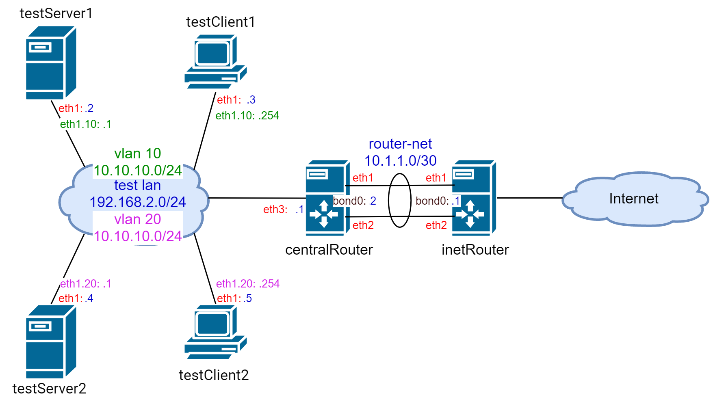
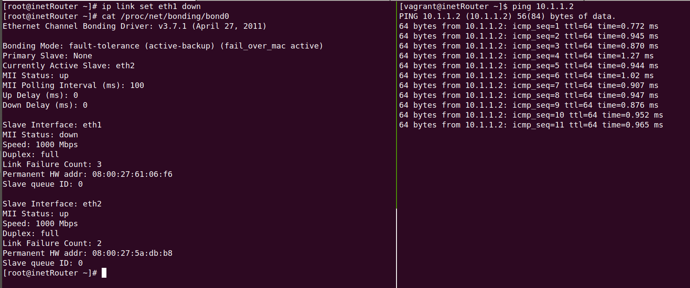

## **Задание**

В Office1 в тестовой подсети появляется сервера с доп интерфесами и адресами
в internal сети testLAN:

- testClient1 - 10.10.10.254
- testClient2 - 10.10.10.254
- testServer1- 10.10.10.1
- testServer2- 10.10.10.1

Развести вланами:

testClient1 <-> testServer1
testClient2 <-> testServer2

Между centralRouter и inetRouter "пробросить" 2 линка (общая inernal сеть) и объединить их в бонд, проверить работу c отключением интерфейсов.

## **Выполнение задания**

Топология сети:



Для поднятия стенда выполнить `vagrant up`. 

## ***1. Проверка vlan'ов***

**testServer1**:
```
[root@testServer1 ~]# ip --brief link show
lo               UNKNOWN        00:00:00:00:00:00 <LOOPBACK,UP,LOWER_UP> 
eth0             UP             52:54:00:8a:fe:e6 <BROADCAST,MULTICAST,UP,LOWER_UP> 
eth1             UP             08:00:27:0f:8a:04 <BROADCAST,MULTICAST,UP,LOWER_UP> 
eth2             UP             08:00:27:65:69:1e <BROADCAST,MULTICAST,UP,LOWER_UP> 
eth1.10@eth1     UP             08:00:27:0f:8a:04 <BROADCAST,MULTICAST,UP,LOWER_UP>
[root@testServer1 ~]# ip --brief addr show
lo               UNKNOWN        127.0.0.1/8 ::1/128 
eth0             UP             10.0.2.15/24 fe80::5054:ff:fe8a:fee6/64 
eth1             UP             192.168.2.2/24 fe80::a00:27ff:fe0f:8a04/64 
eth2             UP             10.11.11.111/24 fe80::a00:27ff:fe65:691e/64 
eth1.10@eth1     UP             10.10.10.1/24 fe80::a00:27ff:fe0f:8a04/64 
[root@testServer1 ~]# ping 10.10.10.254
PING 10.10.10.254 (10.10.10.254) 56(84) bytes of data.
64 bytes from 10.10.10.254: icmp_seq=1 ttl=64 time=0.385 ms
64 bytes from 10.10.10.254: icmp_seq=2 ttl=64 time=0.906 ms
```

**testClient1**:
```
[root@testClient1 ~]# ip --brief link show
lo               UNKNOWN        00:00:00:00:00:00 <LOOPBACK,UP,LOWER_UP> 
eth0             UP             52:54:00:8a:fe:e6 <BROADCAST,MULTICAST,UP,LOWER_UP> 
eth1             UP             08:00:27:b2:be:13 <BROADCAST,MULTICAST,UP,LOWER_UP> 
eth2             UP             08:00:27:b0:aa:9b <BROADCAST,MULTICAST,UP,LOWER_UP> 
eth1.10@eth1     UP             08:00:27:b2:be:13 <BROADCAST,MULTICAST,UP,LOWER_UP>
[root@testClient1 ~]# ip --brief addr show
lo               UNKNOWN        127.0.0.1/8 ::1/128 
eth0             UP             10.0.2.15/24 fe80::5054:ff:fe8a:fee6/64 
eth1             UP             192.168.2.3/24 fe80::a00:27ff:feb2:be13/64 
eth2             UP             10.11.11.121/24 fe80::a00:27ff:feb0:aa9b/64 
eth1.10@eth1     UP             10.10.10.254/24 fe80::a00:27ff:feb2:be13/64
[root@testClient1 ~]# ping 10.10.10.1
PING 10.10.10.1 (10.10.10.1) 56(84) bytes of data.
64 bytes from 10.10.10.1: icmp_seq=1 ttl=64 time=0.824 ms
64 bytes from 10.10.10.1: icmp_seq=2 ttl=64 time=0.747 ms
```

**testServer2**:
```
[root@testServer2 ~]# ip --brief link show
lo               UNKNOWN        00:00:00:00:00:00 <LOOPBACK,UP,LOWER_UP> 
eth0             UP             52:54:00:8a:fe:e6 <BROADCAST,MULTICAST,UP,LOWER_UP> 
eth1             UP             08:00:27:b2:03:de <BROADCAST,MULTICAST,UP,LOWER_UP> 
eth2             UP             08:00:27:c2:7b:f3 <BROADCAST,MULTICAST,UP,LOWER_UP> 
eth1.20@eth1     UP             08:00:27:b2:03:de <BROADCAST,MULTICAST,UP,LOWER_UP>
[root@testServer2 ~]# ip --brief addr show
lo               UNKNOWN        127.0.0.1/8 ::1/128 
eth0             UP             10.0.2.15/24 fe80::5054:ff:fe8a:fee6/64 
eth1             UP             192.168.2.4/24 fe80::a00:27ff:feb2:3de/64 
eth2             UP             10.11.11.112/24 fe80::a00:27ff:fec2:7bf3/64 
eth1.20@eth1     UP             10.10.10.1/24 fe80::a00:27ff:feb2:3de/64
[root@testServer2 ~]# ping 10.10.10.254
PING 10.10.10.254 (10.10.10.254) 56(84) bytes of data.
64 bytes from 10.10.10.254: icmp_seq=1 ttl=64 time=0.619 ms
64 bytes from 10.10.10.254: icmp_seq=2 ttl=64 time=0.921 ms
```

**testClient2**:
```
[root@testClient2 ~]# ip --brief link show
lo               UNKNOWN        00:00:00:00:00:00 <LOOPBACK,UP,LOWER_UP> 
eth0             UP             52:54:00:8a:fe:e6 <BROADCAST,MULTICAST,UP,LOWER_UP> 
eth1             UP             08:00:27:11:eb:78 <BROADCAST,MULTICAST,UP,LOWER_UP> 
eth2             UP             08:00:27:85:76:bb <BROADCAST,MULTICAST,UP,LOWER_UP> 
eth1.20@eth1     UP             08:00:27:11:eb:78 <BROADCAST,MULTICAST,UP,LOWER_UP>
[root@testClient2 ~]# ip --brief addr show
lo               UNKNOWN        127.0.0.1/8 ::1/128 
eth0             UP             10.0.2.15/24 fe80::5054:ff:fe8a:fee6/64 
eth1             UP             192.168.2.5/24 fe80::a00:27ff:fe11:eb78/64 
eth2             UP             10.11.11.122/24 fe80::a00:27ff:fe85:76bb/64 
eth1.20@eth1     UP             10.10.10.254/24 fe80::a00:27ff:fe11:eb78/64
[root@testClient2 ~]# ping 10.10.10.1
PING 10.10.10.1 (10.10.10.1) 56(84) bytes of data.
64 bytes from 10.10.10.1: icmp_seq=1 ttl=64 time=0.744 ms
64 bytes from 10.10.10.1: icmp_seq=2 ttl=64 time=0.820 ms
```

## ***1. Проверка bonding'а***

**inetRouter**:
```
[root@inetRouter ~]# cat /proc/net/bonding/bond0
Ethernet Channel Bonding Driver: v3.7.1 (April 27, 2011)

Bonding Mode: fault-tolerance (active-backup) (fail_over_mac active)
Primary Slave: None
Currently Active Slave: eth1
MII Status: up
MII Polling Interval (ms): 100
Up Delay (ms): 0
Down Delay (ms): 0

Slave Interface: eth1
MII Status: up
Speed: 1000 Mbps
Duplex: full
Link Failure Count: 0
Permanent HW addr: 08:00:27:61:06:f6
Slave queue ID: 0

Slave Interface: eth2
MII Status: up
Speed: 1000 Mbps
Duplex: full
Link Failure Count: 0
Permanent HW addr: 08:00:27:5a:db:b8
Slave queue ID: 0
```

**centralRouter**:
```
root@centralRouter ~]# cat /proc/net/bonding/bond0
Ethernet Channel Bonding Driver: v3.7.1 (April 27, 2011)

Bonding Mode: fault-tolerance (active-backup) (fail_over_mac active)
Primary Slave: None
Currently Active Slave: eth1
MII Status: up
MII Polling Interval (ms): 100
Up Delay (ms): 0
Down Delay (ms): 0

Slave Interface: eth1
MII Status: up
Speed: 1000 Mbps
Duplex: full
Link Failure Count: 0
Permanent HW addr: 08:00:27:1c:c7:db
Slave queue ID: 0

Slave Interface: eth2
MII Status: up
Speed: 1000 Mbps
Duplex: full
Link Failure Count: 0
Permanent HW addr: 08:00:27:02:17:5e
Slave queue ID: 0
```

Видим, что активным интерфесом на обоих роутерах выбран `eth1`. Запустим пинги и выключим `eth1` на **inetRouter**:



На скриншоте видно, что после выключения `eth1`, активным интерфейсом стал `eth2`, пинги при этом не прекратились (можно поверить мне на слово :-)).


***Заметка для себя***
В директории `teaming` лежит исправленный `Vagrantfile` для поднятия стенда в Virtualbox с корректными параметрами сетевых карт для работы network teaming'а. Там же находится ansible-роль _teaming-up_ для конфигурации тиминга между inetRouter и centralRouter. 


